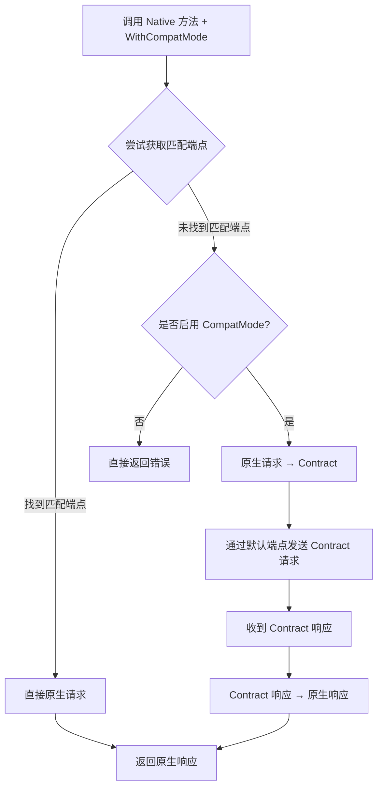

# Portal

Portal 是一个用 Go 语言编写的 AI 网关管理模块，提供多平台 AI 服务的统一接入、负载均衡、健康检查和请求统计功能。该模块旨在简化对多个 AI 平台的访问，提供高可用性和智能路由功能。

## 功能特性

- **统一接入**: 支持多种 AI 平台（包括 OpenAI、Gemini 和 Anthropic）的统一接入
- **三模式 API**: 提供 Contract API（统一格式）、Native API（原生格式）和 Compat API（兼容原生）三种调用方式
- **兼容模式**: Native API 支持 `WithCompatMode()` 选项，在原生端点不可用时自动降级到默认端点
- **智能路由**: 基于模型名称和健康状态自动选择最佳通道，支持多种选择策略
- **通道选择策略**: 内置随机选择和多维 LRU 选择策略，支持自定义扩展
- **健康检查**: 实时监控各平台和通道的健康状态
- **中间件系统**: 支持响应处理中间件，可自定义处理逻辑
- **会话管理**: 提供请求会话生命周期管理和优雅停机
- **错误处理**: 结构化错误码和上下文信息，支持可重试错误判断
- **性能监控**: 请求统计和性能指标收集

## 安装

使用 Go modules 安装 Portal：

```bash
go get github.com/MeowSalty/portal
```

## 使用方法

### 1. 初始化 Portal

```go
import (
    "context"
    "log/slog"
    "time"

    "github.com/MeowSalty/portal"
    "github.com/MeowSalty/portal/logger"
    "github.com/MeowSalty/portal/middleware"
    "github.com/MeowSalty/portal/routing"
    "github.com/MeowSalty/portal/routing/health"
    "github.com/MeowSalty/portal/request"
)

// 创建配置
cfg := &portal.Config{
    PlatformRepo:  yourPlatformRepo,  // 实现 routing.PlatformRepository
    ModelRepo:     yourModelRepo,     // 实现 routing.ModelRepository
    KeyRepo:       yourKeyRepo,       // 实现 routing.KeyRepository
    HealthStorage: yourHealthStorage, // 实现 health.Storage
    LogRepo:       yourLogRepo,       // 实现 request.RequestLogRepository
    Logger:        logger.NewDefaultLogger(), // 可选：自定义日志记录器
    Middlewares:   []middleware.Middleware{yourMiddleware}, // 可选：中间件列表
}

// 创建 Portal 实例
portal, err := portal.New(cfg)
if err != nil {
    log.Fatal("Failed to create Portal:", err)
}
```

### 2. Contract API（统一格式）

Contract API 提供统一的请求/响应格式，自动处理不同平台之间的转换：

```go
import "github.com/MeowSalty/portal/request/adapter/types"

// 创建请求
request := &types.RequestContract{
    Model: "gpt-3.5-turbo",
    Messages: []types.Message{
        {
            Role:    "user",
            Content: "Hello, world!",
        },
    },
}

// 处理聊天完成请求
response, err := portal.ChatCompletion(context.Background(), request)
if err != nil {
    log.Fatal("Failed to process request:", err)
}

// 处理流式聊天完成请求
stream := portal.ChatCompletionStream(context.Background(), request)
for resp := range stream {
    if resp.Type == types.StreamEventContent {
        // 处理流式响应
        fmt.Print(resp.Content)
    }
}
```

### 3. Native API（原生格式）

Native API 允许直接使用各平台的原生请求/响应格式：

#### OpenAI Chat Completions

```go
import openaiChat "github.com/MeowSalty/portal/request/adapter/openai/types/chat"

// OpenAI Chat 原生请求
req := &openaiChat.Request{
    Model: "gpt-4",
    Messages: []openaiChat.Message{
        {Role: "user", Content: "Hello"},
    },
}

// 非流式请求（纯原生模式）
resp, err := portal.NativeOpenAIChatCompletion(ctx, req)

// 非流式请求（兼容模式 - 原生端点不可用时自动降级）
resp, err := portal.NativeOpenAIChatCompletion(ctx, req, portal.WithCompatMode())

// 流式请求（纯原生模式）
stream := portal.NativeOpenAIChatCompletionStream(ctx, req)

// 流式请求（兼容模式）
stream := portal.NativeOpenAIChatCompletionStream(ctx, req, portal.WithCompatMode())
```

#### OpenAI Responses API

```go
import openaiResponses "github.com/MeowSalty/portal/request/adapter/openai/types/responses"

// OpenAI Responses 原生请求
req := &openaiResponses.Request{
    Model: "gpt-4o",
    Input: openaiResponses.Input{
        Messages: []openaiResponses.InputMessage{
            {Role: "user", Content: "Hello"},
        },
    },
}

// 非流式请求（纯原生模式）
resp, err := portal.NativeOpenAIResponses(ctx, req)

// 非流式请求（兼容模式）
resp, err := portal.NativeOpenAIResponses(ctx, req, portal.WithCompatMode())

// 流式请求（纯原生模式）
stream := portal.NativeOpenAIResponsesStream(ctx, req)

// 流式请求（兼容模式）
stream := portal.NativeOpenAIResponsesStream(ctx, req, portal.WithCompatMode())
```

#### Anthropic Messages

```go
import anthropicTypes "github.com/MeowSalty/portal/request/adapter/anthropic/types"

// Anthropic Messages 原生请求
req := &anthropicTypes.Request{
    Model: "claude-3-opus-20240229",
    Messages: []anthropicTypes.Message{
        {Role: "user", Content: []anthropicTypes.ContentBlock{
            {Type: "text", Text: "Hello"},
        }},
    },
    MaxTokens: 1024,
}

// 非流式请求（纯原生模式）
resp, err := portal.NativeAnthropicMessages(ctx, req)

// 非流式请求（兼容模式）
resp, err := portal.NativeAnthropicMessages(ctx, req, portal.WithCompatMode())

// 流式请求（纯原生模式）
stream := portal.NativeAnthropicMessagesStream(ctx, req)

// 流式请求（兼容模式）
stream := portal.NativeAnthropicMessagesStream(ctx, req, portal.WithCompatMode())
```

#### Gemini GenerateContent

```go
import geminiTypes "github.com/MeowSalty/portal/request/adapter/gemini/types"

// Gemini GenerateContent 原生请求
req := &geminiTypes.Request{
    Contents: []geminiTypes.Content{
        {
            Role: "user",
            Parts: []geminiTypes.Part{
                {Text: "Hello"},
            },
        },
    },
}

// 非流式请求（纯原生模式）
resp, err := portal.NativeGeminiGenerateContent(ctx, req)

// 非流式请求（兼容模式）
resp, err := portal.NativeGeminiGenerateContent(ctx, req, portal.WithCompatMode())

// 流式请求（纯原生模式）
stream := portal.NativeGeminiGenerateContentStream(ctx, req)

// 流式请求（兼容模式）
stream := portal.NativeGeminiGenerateContentStream(ctx, req, portal.WithCompatMode())
```

### 4. 兼容模式（Compat Mode）

兼容模式是 Native API 的一种增强选项，通过 `WithCompatMode()` 开启。当原生端点不可用时，系统会自动降级到默认端点，通过 Contract 归一格式中转完成请求。

#### 工作原理



#### 注意事项

- 兼容模式会引入额外的格式转换开销
- 部分平台特定功能在降级转换中可能丢失
- 不传 `WithCompatMode()` 时，行为与纯原生模式一致（端点不匹配直接报错）

### 5. 优雅停机

```go
// 优雅停机，等待最多 30 秒
err := portal.Close(30 * time.Second)
if err != nil {
    log.Fatal("Shutdown error:", err)
}
```

## 包结构

```tree
portal/
├── contract_chat.go       # Contract API 聊天完成
├── native_options.go      # Native API 选项定义（WithCompatMode 等）
├── native_compat.go       # 兼容模式降级路径实现
├── native_anthropic.go    # Anthropic Native API
├── native_gemini.go       # Gemini Native API
├── native_openai.go       # OpenAI Native API
├── portal.go              # 核心入口
├── types.go               # 核心类型定义
├── errors/                # 错误处理模块
├── logger/                # 日志模块
├── middleware/            # 中间件模块
│   ├── middleware.go      # 中间件接口定义
│   └── chain.go           # 中间件链
├── request/               # 请求处理模块
│   ├── request.go         # 核心请求处理逻辑
│   ├── native.go          # Native API 处理
│   ├── stream.go          # 流式响应处理
│   └── adapter/           # 平台适配器实现
│       ├── adapter.go     # 适配器接口
│       ├── openai/        # OpenAI 适配器
│       │   ├── converter/ # 请求/响应转换器
│       │   └── types/     # OpenAI 类型定义
│       │       ├── chat/      # Chat Completions 类型
│       │       └── responses/ # Responses API 类型
│       ├── gemini/        # Gemini 适配器
│       │   ├── converter/ # 请求/响应转换器
│       │   └── types/     # Gemini 类型定义
│       └── anthropic/     # Anthropic 适配器
│           ├── converter/ # 请求/响应转换器
│           └── types/     # Anthropic 类型定义
├── routing/               # 路由管理模块
│   ├── routing.go         # 核心路由逻辑
│   ├── channel.go         # 通道定义
│   ├── health/            # 健康检查实现
│   └── selector/          # 通道选择策略
│       ├── types.go       # 选择器接口定义
│       ├── factory.go     # 选择器工厂
│       ├── random.go      # 随机选择器
│       └── lru.go         # 多维 LRU 选择器
└── session/               # 会话管理模块
```

## 核心概念

### 三种 API 模式对比

| 模式                | 入口格式 | 路由策略                       | 出口格式 | 适用场景                 |
| ------------------- | -------- | ------------------------------ | -------- | ------------------------ |
| Contract API        | 统一格式 | 默认端点                       | 统一格式 | 跨平台兼容、统一处理     |
| Native API          | 原生格式 | 指定 Provider 端点             | 原生格式 | 平台特定功能、无额外开销 |
| Native API + Compat | 原生格式 | 先尝试指定端点，降级到默认端点 | 原生格式 | 高可用、渐进式迁移       |

- **Contract API**: 提供统一的请求/响应格式，自动处理不同平台之间的转换。适合需要跨平台兼容的场景。
- **Native API**: 直接使用各平台的原生请求/响应格式，支持平台特定功能。适合需要使用特定平台高级功能的场景。
- **兼容模式**: Native API 的增强选项，在原生端点不可用时自动降级，兼顾原生格式的便利性和高可用性。

### 适配器 (Adapter)

适配器负责与特定 AI 平台的 API 交互，目前支持：

- **OpenAI**: Chat Completions API 和 Responses API
- **Gemini**: GenerateContent API
- **Anthropic**: Messages API

### 路由 (Routing)

路由模块负责根据模型名称查找可用通道，并基于健康状态选择最佳通道。

### 通道选择策略 (Selector)

通道选择策略决定从多个可用通道中选择哪个通道进行请求：

- **Random**: 随机选择一个可用通道
- **Multi-Dim LRU**: 基于平台、模型、密钥三个维度的 LRU 策略，优先选择最近最少使用的通道

支持通过工厂模式注册自定义选择策略。

### 中间件 (Middleware)

中间件系统允许在响应返回前进行处理：

- **Middleware**: 无状态中间件，适用于简单处理
- **StreamMiddleware**: 有状态中间件，支持跨 chunk 处理

### 会话 (Session)

会话管理模块处理请求的生命周期，包括优雅停机和上下文取消。

### 错误处理 (Error Handling)

提供结构化错误码和上下文信息，支持：

- 可重试错误判断（`errors.IsRetryable(err)`）
- 错误码检查（`errors.IsCode(err, code)`）
- HTTP 状态码获取（`errors.GetHTTPStatus(err)`）

### 性能监控 (Performance Monitoring)

收集和分析请求统计信息，提供性能洞察和优化建议。
